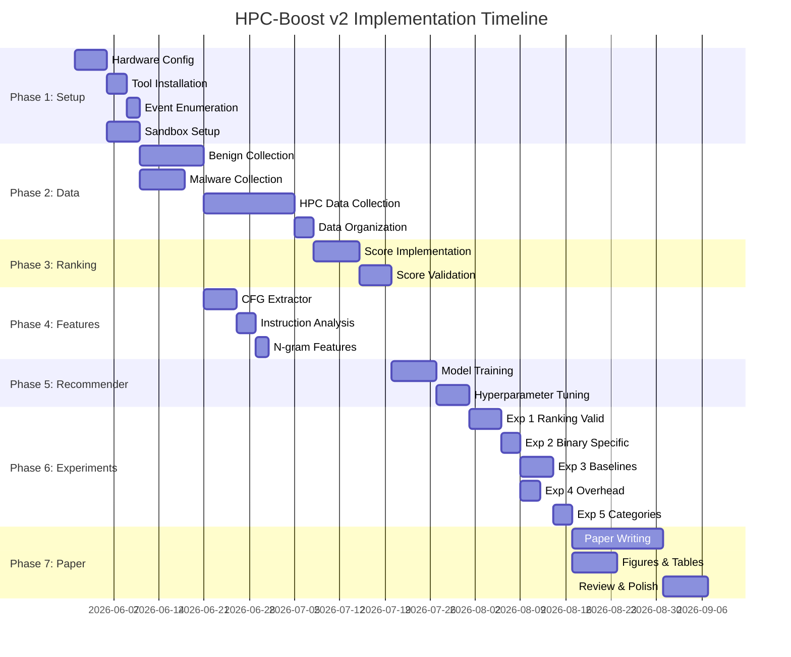

# HPC-Boost v2: Comprehensive Implementation Plan

## Project Context

**Original paper**: "HPC-Boost: A Binary driven ML Framework for boosting HPC based Runtime Attack Detection" — rejected at DATE 2021 (scores: +1, -2, -1, -1).

**Core idea**: Different binaries should be monitored with different sets of HPC events for optimal anomaly detection. The framework uses statistical ranking of events per-binary, extracts static binary features, and trains a neural network to learn the mapping from binary features → event rankings.

**This plan**: Addresses every reviewer criticism, incorporates 5 years of field advancement (2021–2026), and produces a significantly stronger paper with real malware, proper baselines, overhead analysis, and improved methodology.

---

## User Review Required

> [!IMPORTANT]
> **Hardware availability (CONFIRMED)**: We are using a laptop with an **Intel Core i5-13450HX** (13th Gen Raptor Lake, Hybrid Architecture). This is a modern, high-performance CPU. Due to its hybrid design (P-cores and E-cores), we must pin execution using `taskset` and target the appropriate PMU (`cpu_core`) to ensure consistent data collection.

> [!IMPORTANT]
> **Malware handling**: Phases 4–5 require running real malware binaries in a sandboxed VM. **Do you have access to a virtualization setup (VirtualBox/KVM/QEMU) and are you comfortable running malware samples in an isolated environment?**

> [!WARNING]
> **Timeline**: The full plan requires approximately **10–14 weeks** of focused work. This can be compressed if tasks are parallelized between team members. **How many people are working on this and what's your deadline?**

## Open Questions

> [!IMPORTANT]
> 1. **Target venue**: Should we target IEEE DATE again, or consider IEEE HOST, IEEE T-TDSC (journal), IEEE T-IFS, RAID, or ACSAC? The venue choice affects paper length, formatting, and which experiments are essential vs. nice-to-have.

> [!IMPORTANT]
> 2. **Scope of contribution**: The original HPC-Boost claims both (a) a ranking methodology and (b) a recommender system. Should we focus the paper on the ranking methodology with binary-specific selection as the core contribution, or maintain both? The recommender is novel but adds complexity that reviewers questioned.

> [!NOTE]
> 3. **Previous students' code**: The HPC_BOOST_REPORT shows previous students (Varun, Aaditya, Samriddh) used likwid-perfctr and created a 2-stage LSTM pipeline. The 2-stage malware detection report shows an LSTM autoencoder approach. Should we build on their code or start fresh with a cleaner implementation?

---

## Phase 0: Situation Assessment — What Went Wrong & What's Changed

### What the Reviewers Said (Synthesized)

| Criticism | Reviewers | Severity | Our Fix |
|---|---|---|---|
| Self-crafted attack programs instead of real malware | R1, R2, R3 | **CRITICAL** | Use RaDaR dataset + MalwareBazaar samples |
| No overhead/latency analysis | R2, R4 | **HIGH** | Full pipeline timing with breakdown per module |
| No comparison with prior work | R2, R4 | **HIGH** | Implement 2SMaRT (Pearson), Kadiyala (PCA), global-fixed baselines |
| Poor figure quality (missing legends, units, labels) | R1, R3, R4 | **MEDIUM** | Publication-quality matplotlib/pgfplots figures |
| Weak experimental validation / straightforward results | R2, R3 | **HIGH** | 5 distinct experiments with statistical significance tests |
| Writing quality / typos | R1, R2, R4 | **MEDIUM** | Professional proofreading + LaTeX best practices |
| Detection time unclear (runtime attacks take seconds, not minutes) | R2 | **HIGH** | Clarify sampling frequency, detection latency, real-time capability |
| Correlation equation not explained | R2 | **MEDIUM** | Full mathematical formalization of all 4 scores |
| No discussion of malware types vs. event selection | R1 | **MEDIUM** | Category-wise analysis (ransomware, rootkit, cryptominer, etc.) |
| Short vs. long time series distinction unclear | R2 | **MEDIUM** | Formal definition with mathematical justification |

### What's New in the Field Since 2021

| Development | Paper/Source | Relevance |
|---|---|---|
| **SUNDEW** (IEEE T-TDSC 2024) | Karapoola & Rebeiro, IIT Madras | Per-malware-class event selection — closest published work to HPC-Boost. We must cite and compare. |
| **RaDaR Dataset** (2022) | Karapoola et al., IIT Madras | Public HPC dataset with real malware — directly solves reviewer criticism #1 |
| **Moving Target Defense for HPCs** (IEEE T-CAD 2021) | Kuruvila et al. | Varying monitored events as defense — HPC-Boost does this implicitly per-binary |
| **Adversarial Attacks on HPC detectors** (2020–2023) | Kuruvila, Kundu et al. | Shows fixed event sets are vulnerable — motivates dynamic selection |
| **"HPC detectors actually work"** (IEEE 2022) | Konstantinou & Karri | Validates the entire field after skepticism from Das et al. (2019) |
| **LSTM/Transformer time-series detection** (2023–2025) | TS-HMD, various | Modern DL architectures for HPC time-series — potential upgrade for anomaly detector |
| **Comprehensive survey** (2024) | Multiple | Field maturity allows better positioning of contribution |

### Previous Students' Work Assessment

#### Team 1 (Varun, Aaditya, Samriddh — HPC_BOOST_REPORT)
- ✅ Collected data for 400+ HPC events using likwid-perfctr
- ✅ Built daemon-based profiling infrastructure
- ✅ Implemented benign + malicious data collection with core-specific tracking
- ❌ Used simulated malware (mergesort, matrix multiplication as "malware")
- ❌ Used Gaussian/Poisson noise injection instead of real attacks
- ❌ Feature ranking was post-hoc, not the HPC-Boost ranking methodology
- **Reusable**: Data collection scripts, likwid-perfctr integration, basic profiling pipeline

#### Team 2 (2-Stage Malware Detection Report)
- ✅ Built 2-stage detection: LSTM prediction → LSTM classification
- ✅ Used cosine similarity for anomaly flagging (threshold 0.3)
- ✅ Identified malware core location
- ❌ Stage 2 predictions "don't seem very promising"
- ❌ No integration with HPC-Boost ranking/recommendation framework
- **Reusable**: LSTM architecture patterns, time-series windowing approach

#### GitHub Repo: chutitepw/HPC_Ransomware_Detection
- **Backed by IEEE TCAS-I 2023 publication** ("HARD-Lite: A Lightweight Hardware Anomaly Realtime Detection Framework Targeting Ransomware")
- Uses **K-LEB kernel module** (not just perf stat) — custom kernel-level monitoring at **10ms intervals**
- Monitors 6 HPC events: Branch Instructions Retired, Instructions Retired, Data Cache Access, Memory Load/Store, LLC Misses
- Implements CNN, MLP, LSTM, LSTM-Anomaly, XGBoost, LightGBM classifiers
- ~99% accuracy — but system-wide monitoring (not per-process)
- **Reusable**: Model architectures (CNN, LSTM, XGBoost), LSTM anomaly detection approach (trains only on benign data), validated HPC event selection

#### GitHub Repo: omarmuhamed/Malware-Detection-With-Performance-Counters
- ⚠️ **Uses Windows software performance counters** (handle count, I/O rates, page faults) — **NOT hardware HPCs** despite the name
- Custom C# data collection tool (PerfExtract) — Windows only, 0.5s sampling
- Deep CNN, FCN, MLP, ResNet, InceptionTime for time-series classification
- >95% accuracy across most models
- **Reusable**: Data processing pipeline (CSV → 3D numpy array → normalize → split), ResNet/FCN time-series architectures — but the data collection approach is not applicable to our Linux/HPC context

---

## Phase 1: Environment & Infrastructure Setup

**Duration**: 1–2 weeks  
**Rationale**: A reproducible, clean environment is the foundation everything else depends on. The original paper's environment (i5-3337U, Ubuntu 18.04, Perf 4.14.18) is outdated. We will configure a modern setup tailored to our Intel Core i5-13450HX processor under a recent Linux kernel.

### 1.1 Hardware & OS Configuration (Intel Core i5-13450HX)

```
Target Hardware: Intel Core i5-13450HX (Raptor Lake)
- Cores: 6 Performance Cores (P-cores, hyper-threaded) + 4 Efficient Cores (E-cores)
- PMU Names: cpu_core (P-cores), cpu_atom (E-cores)
OS: Ubuntu 22.04 LTS or 24.04 LTS
Kernel: 6.x series (strongly recommended for robust Intel hybrid PMU support)
```

**Steps:**
1. Install Ubuntu on bare metal (NOT a VM — VMs add noise to HPC readings)
   - **Why**: Hypervisors intercept hardware events and introduce measurement artifacts. All serious HPC papers use bare-metal.
   - *Note*: If using a VM is unavoidable, we must use KVM/QEMU with CPU pass-through (`-cpu host`) and pin the virtual CPUs to specific physical P-cores on the host.
2. Configure `perf_event_paranoid`:
   ```bash
   echo -1 | sudo tee /proc/sys/kernel/perf_event_paranoid
   ```
   - **Why**: Value of -1 allows all users to access all performance counters. Required for comprehensive event monitoring.
3. Disable CPU frequency scaling:
   ```bash
   sudo cpupower frequency-set -g performance
   ```
   - **Why**: DVFS (Dynamic Voltage and Frequency Scaling) causes non-deterministic HPC readings. R2's criticism about detection time is partly about this.
4. Pin Profiling Execution to Core Type (Hybrid Architecture Isolation):
   - **Why**: P-cores (cpu_core) and E-cores (cpu_atom) have entirely different microarchitectures. If a program shifts between P-cores and E-cores, its HPC signature will fluctuate wildly, breaking the model.
   - **How**: Pin execution to specific cores using `taskset`. 
     - Identify P-core CPU IDs: `cat /sys/devices/cpu_core/cpus` (usually cores 0-11, representing 6 cores × 2 threads).
     - Run benign binaries pinned to P-cores, e.g., `taskset -c 0 perf stat -e cpu_core/cycles/ ...`
5. Disable Hyper-Threading (or isolate physical cores):
   - **Why**: Sibling threads on a physical P-core share the same physical PMU counters, leading to resource contention and counter contamination.
   - **How**: Disable HT in BIOS, or only pin execution to even-numbered CPU IDs (e.g., `taskset -c 0,2,4,6,8,10`).
6. Disable Turbo Boost:
   ```bash
   echo 1 | sudo tee /sys/devices/system/cpu/intel_pstate/no_turbo
   ```
7. Document CPU model and PMU capabilities:
   ```bash
   perf list                    # List available events (note cpu_core vs cpu_atom prefixes)
   cat /proc/cpuinfo | head -30 # Verification of CPU model

### 1.2 Tool Installation

| Tool | Purpose | Installation |
|---|---|---|
| `perf` | HPC event monitoring | `sudo apt install linux-tools-$(uname -r)` |
| `likwid` | Alternative HPC profiler (used by previous team) | `sudo apt install likwid` |
| `angr` | Binary analysis / CFG extraction | `pip install angr` |
| Python 3.10+ | All ML/statistical code | System default or conda |
| PyTorch 2.x | Recommender neural network | `pip install torch` |
| scipy/statsmodels | Statistical tests (Mann-Kendall, ADF, PP, KPSS) | `pip install scipy statsmodels pymannkendall` |
| networkx | CFG analysis | `pip install networkx` |
| capstone | Disassembly for instruction analysis | `pip install capstone` |
| QEMU/KVM | Malware sandbox (separate from profiling machine) | `sudo apt install qemu-kvm` |

### 1.3 Event Enumeration

**Objective**: Catalog all monitorable HPC events on our specific hardware.

```bash
# Get all hardware events
perf list hw > events_hw.txt

# Get all hardware cache events  
perf list cache > events_cache.txt

# Get all software events
perf list sw > events_sw.txt

# Get all tracepoint events (optional — very large list)
perf list tracepoint > events_tp.txt

# Get all PMU events (processor-specific)
perf list pmu > events_pmu.txt
```

**Deliverable**: `event_catalog.json` — a structured file mapping event names to categories, with notes on which events can be monitored simultaneously without multiplexing.

**Why this matters**: The original paper claims "400+" events. We need the exact number for our specific hardware, and we need to know which ones require multiplexing (those should be flagged in our ranking).

### 1.4 Malware Sandbox Setup

**Objective**: Safe environment for executing real malware samples.

1. Create a KVM/QEMU VM with Ubuntu 22.04
2. Snapshot the clean state
3. Network isolation (no outbound connections)
4. Shared folder for data extraction (read-only from host)
5. Script to restore clean snapshot after each malware run

> [!CAUTION]
> Real malware must NEVER be executed on the bare-metal profiling machine directly unless fully sandboxed. The profiling machine collects HPC data for benign binaries. Malware HPC data is collected separately in the sandbox, OR we use the RaDaR dataset which provides pre-collected HPC traces.

---

## Phase 2: Dataset Construction

**Duration**: 2–3 weeks  
**Rationale**: This is the single most important phase. Every reviewer criticized the use of self-crafted attack programs. This phase directly addresses the #1 rejection reason.

### 2.1 Benign Binary Collection

We need a diverse set of legitimate binaries representing real-world workloads. The original paper used MiBench + self-constructed algorithm programs.

**Benchmark suites to use:**

| Suite | # Binaries | Category | Why |
|---|---|---|---|
| **MiBench** | ~35 | Embedded | Used in original paper; maintains continuity |
| **SPEC CPU 2017** (if available) | ~43 | General compute | Gold standard for CPU benchmarking |
| **Phoronix Test Suite** | ~200+ | Mixed | Free, well-documented, covers diverse workloads |
| **UnixBench** | ~10 | System | Previous team already used it |
| **CoreMark** | 1 | Embedded core | Industry standard embedded benchmark |
| **PARSEC** | ~13 | Parallel | Multi-threaded workloads (important for multi-core scenarios) |
| **Custom algorithms** | ~20 | Algorithmic | Sorting, graph, DP, crypto — from original paper |
| **Real applications** | ~10 | User-facing | nginx, sqlite, ffmpeg, ImageMagick, openssl |

**Target**: **≥80 distinct benign binaries** across categories  
**Why 80**: The original paper doesn't specify exactly how many binaries were used, but the train-test split was 20-80. With 80 binaries, we get 16 training and 64 testing — enough for statistical significance. More is better.

**For each binary, record:**
- Binary path and hash (SHA256)
- Source (which benchmark suite)
- Category (compute-intensive, I/O-intensive, memory-intensive, mixed)
- Approximate runtime
- Input specification (must be deterministic across runs)

### 2.2 Malware Binary Collection

**Three sources, ordered by priority:**

#### Source 1: RaDaR Dataset (Pre-collected HPC traces)
- **What**: Real-world dataset from IIT Madras with HPC traces of malware execution.
- **Paper**: Karapoola et al., "RaDaR: A Real-World Dataset for AI powered Run-time Detection of Cyber-Attacks"
- **Status**: ✅ **Downloaded and Inspected**
  - Found on Kaggle ("Open Malware Research Jugaad Trails").
  - Contains **3,471 unique malware samples** (time-series CSVs).
  - Contains **54 real PMU hardware events** (e.g., `Core_cyc`, `L1D_Miss`, `BrMispred`, `DTLBLoadMissWD`).
  - Labeled with fine-grained malware families (e.g., trojan, ransomware, deceptor, cryptominer) and goals.
- **Why**: Published, peer-reviewed, used by SUNDEW (the closest comparison paper). Using this dataset makes our results directly comparable. We will use this dataset to validate the ranking methodology and test the pipeline end-to-end before moving to our own collected data.

#### Source 2: MalwareBazaar / VirusTotal (Live malware samples)
- **What**: Real malware binaries (ELF format for Linux)
- **Categories to include:**

  | Category | # Samples | Examples | Why |
  |---|---|---|---|
  | Ransomware | ≥10 | WannaCry variants, Linux ransomware | High-impact, distinct HPC signature (crypto ops) |
  | Cryptominers | ≥10 | XMRig variants | CPU-intensive, should show clear HPC signal |
  | Rootkits | ≥5 | Linux rootkit samples | Kernel-level manipulation |
  | DDoS bots | ≥5 | Mirai variants | Network + CPU patterns |
  | Reverse shells | ≥5 | Common payloads | I/O-intensive |
  | RATs | ≥5 | Linux RATs | Mixed behavior |

- **Target**: **≥40 distinct malware families**
- **Why multiple families**: R1 specifically asked whether detection changes with malware type. R3 wants category-wise analysis.

#### Source 3: Controlled Attack Simulations (Supplementary)
Keep a small number of controlled attacks (like the original paper's opcode modification) as a controlled baseline, but label them clearly as "synthetic attacks" distinct from real malware.

- Buffer overflow exploits (compiled from public PoCs)
- ROP chain attacks
- Code injection attacks
- **Target**: ~10 synthetic attack programs

### 2.3 HPC Data Collection Pipeline

**For each (binary, event) pair, collect 5 independent runs.**

```python
# Pseudocode for data collection
for binary in all_binaries:
    for event in all_monitorable_events:
        for run in range(5):
            # 1. Reset system state
            flush_caches()
            sync_filesystem()
            sleep(2)  # Cool-down period
            
            # 2. Start perf monitoring
            # Sample at 1000 Hz (1 sample/ms)
            cmd = f"perf stat -e {event} -I 100 -o {output_file} {binary} {input_args}"
            
            # 3. Execute and record
            run_and_wait(cmd)
            
            # 4. Validate output
            assert_valid_hpc_data(output_file)
```

**Critical parameters:**
- **Sampling interval**: 100ms (`-I 100` in perf) — balances granularity vs. overhead
  - R2 asked about sampling frequency. We need to justify this choice.
  - 100ms = 10 samples/second. For a 60-second binary, that's 600 data points per event per run.
- **Number of runs**: 5 (same as original paper — provides statistical basis for spread/trend scores)
- **System restart between runs**: The original paper restarts after each run. We should at least flush caches and wait for system quiescence.

**Data volume estimate:**
- 80 binaries × 400 events × 5 runs = 160,000 data files
- Each file: ~600 lines × ~50 bytes = ~30KB
- Total: ~4.8 GB raw data

> [!WARNING]
> **This is the bottleneck.** With 4 simultaneous PMU registers, we need 100 separate profiling passes per binary per run (400 events ÷ 4 registers). For 80 binaries × 5 runs × 100 passes = 40,000 profiling executions. If each binary takes 60 seconds, that's **40,000 minutes ≈ 28 days of continuous execution.**
>
> **Mitigation strategies:**
> 1. Parallelize across multiple cores (run 4 binaries simultaneously on different cores with core pinning)
> 2. Use shorter input sizes for initial ranking (30-second runs instead of 60)
> 3. Pre-filter obviously irrelevant events (e.g., tracepoints that never fire)
> 4. Use likwid's event grouping to monitor compatible events simultaneously

### 2.4 Data Organization

```
data/
├── benign/
│   ├── mibench/
│   │   ├── basicmath/
│   │   │   ├── metadata.json        # Binary info, input, category
│   │   │   ├── events/
│   │   │   │   ├── cache-misses/
│   │   │   │   │   ├── run_1.csv
│   │   │   │   │   ├── run_2.csv
│   │   │   │   │   ├── run_3.csv
│   │   │   │   │   ├── run_4.csv
│   │   │   │   │   └── run_5.csv
│   │   │   │   ├── branch-misses/
│   │   │   │   │   └── ...
│   │   │   │   └── ...
│   │   │   └── ranking.json         # Final event rankings for this binary
│   │   └── ...
│   ├── spec2017/
│   ├── phoronix/
│   └── custom/
├── malware/
│   ├── radar_dataset/               # Pre-collected HPC traces
│   ├── live_samples/                # Our collected data
│   │   ├── ransomware/
│   │   ├── cryptominer/
│   │   └── ...
│   └── synthetic/                   # Controlled attack simulations
├── features/
│   ├── binary_features/             # Extracted binary feature vectors
│   └── feature_metadata.json
└── processed/
    ├── rankings/                    # Event rankings per binary
    ├── train_test_splits/
    └── baseline_results/
```

---

## Phase 3: Ranking Module — Reimplementation & Enhancement

**Duration**: 2–3 weeks  
**Rationale**: This is the intellectual core of HPC-Boost. The original implementation works but needs mathematical formalization (R2), better documentation, and enhancements informed by recent literature.

### 3.1 Score 1: Spread Score (Reimplemented)

**Original**: `Spread Score = 1 / IQR`, averaged over 5 runs.

**Enhanced version:**
```python
def spread_score(event_data_runs: List[np.ndarray]) -> float:
    """
    Measures the tightness of the HPC event's value distribution.
    
    Rationale: A tight distribution (low IQR) means the event has consistent 
    values during normal execution. When malware perturbs execution, even 
    small deviations will be detectable against this tight baseline.
    
    We use IQR instead of standard deviation because IQR is robust to outliers
    (Hampel, 1974). Outliers in HPC data commonly arise from context switches, 
    interrupts, and measurement artifacts.
    """
    scores = []
    for run_data in event_data_runs:
        q75, q25 = np.percentile(run_data, [75, 25])
        iqr = q75 - q25
        if iqr == 0:
            scores.append(float('inf'))  # Perfectly consistent = best possible
        else:
            scores.append(1.0 / iqr)
    
    # Use median instead of mean for robustness
    return float(np.median(scores))
```

**Enhancement over original**: Use median instead of mean across runs (more robust to a single bad run).

### 3.2 Score 2: Trend Score (Reimplemented)

**Original**: Mann-Kendall trend test, comparing trends across runs.

**Enhanced version:**
```python
import pymannkendall as mk

def trend_score(event_data_runs: List[np.ndarray]) -> float:
    """
    Measures consistency of time-series trend across multiple runs.
    
    Rationale: A good event for anomaly detection should show consistent 
    behavior (similar trend) across multiple executions of the same binary.
    If the trend varies wildly between runs, the event is unreliable as a 
    baseline for detecting anomalies.
    
    We use Mann-Kendall because it's non-parametric (no distribution 
    assumption) and more powerful than t-test for detecting monotonic trends
    (Önöz & Bayazit, 2003 — ref [33] in original paper).
    """
    trend_stats = []
    for run_data in event_data_runs:
        result = mk.original_test(run_data)
        trend_stats.append(result.s)  # Mann-Kendall S statistic
    
    # Score = inverse of coefficient of variation of S statistics across runs
    # High score = consistent trend direction and magnitude across runs
    mean_s = np.mean(trend_stats)
    std_s = np.std(trend_stats)
    
    if std_s == 0:
        return float('inf')  # Perfect consistency
    
    return abs(mean_s) / std_s  # Signal-to-noise ratio of trend
```

### 3.3 Score 3: Correlation Score (Reimplemented & Formalized)

**Original**: Spearman correlation between event pairs, selecting events with low inter-correlation.

**R2's criticism**: "The equation is not explained properly, and it does not have any expression to handle the time component."

**Formal mathematical definition:**

For event $e_i$, let $\mathbf{x}_i \in \mathbb{R}^T$ be its time-series data (T time steps).

$$\text{CorrScore}(e_i) = \min\left(\frac{1}{N-1} \sum_{j \neq i} (1 - |\rho_s(\mathbf{x}_i, \mathbf{x}_j)|), \quad \frac{1}{\sum_{j \neq i} |\rho_s(\mathbf{x}_i, \mathbf{x}_j)|}\right)$$

where $\rho_s$ is the Spearman rank correlation coefficient.

```python
from scipy.stats import spearmanr

def correlation_score(event_idx: int, all_event_data: Dict[str, np.ndarray]) -> float:
    """
    Measures how independent this event is from other events.
    
    Rationale: We want to select events that capture different aspects of 
    system behavior. If event A and event B are highly correlated, monitoring 
    both is redundant — we only need one. This score rewards events that are 
    uncorrelated with others.
    
    We use Spearman (not Pearson) because:
    1. Spearman detects monotonic non-linear relationships (Pearson only linear)
    2. HPC event relationships are often non-linear (e.g., cache misses vs. 
       memory bandwidth have a sigmoid-like relationship)
    3. Spearman is non-parametric — no normality assumption needed
    """
    event_names = list(all_event_data.keys())
    target_data = all_event_data[event_names[event_idx]]
    
    correlations = []
    for j, name in enumerate(event_names):
        if j != event_idx:
            rho, _ = spearmanr(target_data, all_event_data[name])
            correlations.append(abs(rho))
    
    # Two complementary measures (as in original paper)
    avg_independence = np.mean([1 - c for c in correlations])
    inv_total_correlation = 1.0 / (sum(correlations) + 1e-10)
    
    return min(avg_independence, inv_total_correlation)
```

### 3.4 Score 4: Stationarity Score (Reimplemented with Clear Short/Long Distinction)

**R2's criticism**: "The idea of short and long is not clear in the discussion."

**Formal definition:**

- **Short series**: 25 ≤ T < 100 samples → Use PP test + KPSS test combination
  - **Why PP + KPSS**: PP alone has weak power for short series (Phillips & Perron, 1988). KPSS tests the null of stationarity (opposite null), so combining them reduces Type II error. Recommended by Arltová & Fedorová (2016) — ref [36].
- **Long series**: T ≥ 100 samples → Use ADF test + PP test combination
  - **Why ADF + PP**: ADF assumes homoscedastic errors, PP doesn't. Combining handles both cases. For long series, both have good power.
- **Both**: Add Zivot-Andrews test to allow for ≤2 structural breaks
  - **Why**: Program startup and shutdown cause structural breaks in HPC data. Ignoring these leads to false non-stationarity conclusions.

```python
from statsmodels.tsa.stattools import adfuller, kpss
from arch.unitroot import PhillipsPerron, ZivotAndrews

def stationarity_score(event_data: np.ndarray) -> float:
    """
    Measures how stationary (predictable) the event's time-series is.
    
    Rationale: Anomaly detectors (One-Class SVM, Isolation Forest) work best 
    when the baseline data has stable statistical properties. A highly 
    non-stationary event (trending, periodic shifts) makes it hard to 
    distinguish genuine anomalies from natural drift.
    
    Short series (25-100 samples): PP + KPSS
    Long series (100+ samples): ADF + PP
    Both: Zivot-Andrews for structural break robustness
    """
    T = len(event_data)
    scores = []
    
    if T < 25:
        return 0.0  # Insufficient data
    
    # Remove fitted seasonality first (sinusoidal decomposition)
    deseasonalized = remove_seasonality(event_data)
    
    if T < 100:  # Short series
        # PP test (null: unit root = non-stationary)
        pp_result = PhillipsPerron(deseasonalized)
        pp_score = -pp_result.stat  # More negative = more stationary
        scores.append(pp_score)
        
        # KPSS test (null: stationary)
        kpss_stat, kpss_pval, _, _ = kpss(deseasonalized, regression='c')
        kpss_score = -kpss_stat  # Less positive = more stationary
        scores.append(kpss_score)
    else:  # Long series
        # ADF test (null: unit root)
        adf_stat, adf_pval, _, _, _, _ = adfuller(deseasonalized)
        scores.append(-adf_stat)
        
        # PP test
        pp_result = PhillipsPerron(deseasonalized)
        scores.append(-pp_result.stat)
    
    # Zivot-Andrews (allows structural breaks)
    try:
        za = ZivotAndrews(deseasonalized, method='both')
        scores.append(-za.stat)
    except:
        pass  # Some series may fail
    
    return float(np.mean(scores))
```

### 3.5 Final Score Combination

**Original**: Plain addition of normalized scores.

**Enhancement**: Investigate weighted combination.

```python
def final_event_score(spread, trend, correlation, stationarity, 
                       weights=[0.25, 0.25, 0.25, 0.25]) -> float:
    """
    Combine normalized scores into final ranking score.
    
    Each score is first min-max normalized across all events to [0, 1].
    Then combined with weights. Default: equal weights.
    
    Future work: Learn optimal weights via cross-validation.
    """
    scores = [spread, trend, correlation, stationarity]
    return sum(w * s for w, s in zip(weights, scores))
```

**New addition — sensitivity score (addressing R1's concern about malware type interaction):**

```python
def sensitivity_score(event_data_benign: np.ndarray, 
                       event_data_malicious: np.ndarray) -> float:
    """
    NEW SCORE: Measures how much this event's distribution shifts 
    between benign and malicious execution.
    
    Rationale: R1 asked whether branch-related events have an advantage 
    for detecting branch-instruction attacks. This score quantifies 
    exactly that — the effect size of malware on each event.
    
    Uses Kolmogorov-Smirnov test statistic as the effect size measure.
    KS is distribution-free and captures any type of distributional difference.
    """
    from scipy.stats import ks_2samp
    ks_stat, _ = ks_2samp(event_data_benign, event_data_malicious)
    return ks_stat
```

> [!NOTE]
> The sensitivity score is optional for the ranking module (since ranking should ideally be attack-agnostic, as the original paper argues). But computing it and reporting it in the paper addresses R1's concern and provides a richer analysis. We can report it as a supplementary validation that our statistical ranking correlates with empirically-measured sensitivity.

---

## Phase 4: Feature Extractor Module — Reimplementation & Enhancement

**Duration**: 1–2 weeks  
**Rationale**: The feature extractor is the deployment-time component — it must be lightweight and produce discriminative feature vectors.

### 4.1 CFG Features (Enhanced)

**Original features:**
- Number of basic blocks
- Instructions per basic block
- Number of loops

**Enhanced feature set:**

```python
import angr

def extract_cfg_features(binary_path: str) -> dict:
    """
    Extract Control Flow Graph features from binary.
    
    Uses angr (ref [29]) for binary analysis. All extraction is static —
    no binary execution required.
    """
    proj = angr.Project(binary_path, auto_load_libs=False)
    cfg = proj.analyses.CFGFast()
    
    features = {}
    
    # Basic CFG metrics
    features['num_basic_blocks'] = len(cfg.graph.nodes())
    features['num_edges'] = len(cfg.graph.edges())
    features['num_functions'] = len(cfg.kb.functions)
    
    # Block-level statistics
    block_sizes = [node.size for node in cfg.graph.nodes() if node.size]
    features['avg_block_size'] = np.mean(block_sizes) if block_sizes else 0
    features['max_block_size'] = max(block_sizes) if block_sizes else 0
    features['std_block_size'] = np.std(block_sizes) if block_sizes else 0
    
    # Loop detection
    import networkx as nx
    cycles = list(nx.simple_cycles(cfg.graph))
    features['num_loops'] = len(cycles)
    
    # Cyclomatic complexity (McCabe)
    features['cyclomatic_complexity'] = (
        features['num_edges'] - features['num_basic_blocks'] + 2 * features['num_functions']
    )
    
    # Function-level features
    func_sizes = [f.size for f in cfg.kb.functions.values() if f.size]
    features['avg_function_size'] = np.mean(func_sizes) if func_sizes else 0
    features['num_syscalls'] = count_syscalls(cfg)
    
    # Branching characteristics
    features['branch_ratio'] = count_branch_instructions(cfg) / max(features['num_basic_blocks'], 1)
    
    return features
```

### 4.2 Instruction Throughput Features (Enhanced)

**Original**: BFS traversal of CFG, count instructions by type, multiply by loop iterations.

**Enhancement**: Use capstone disassembler for more precise instruction classification.

```python
from capstone import Cs, CS_ARCH_X86, CS_MODE_64

def extract_instruction_features(binary_path: str) -> dict:
    """
    Estimate runtime instruction mix from static analysis.
    
    Categories based on microarchitectural resource usage:
    - ALU ops (add, sub, mul, div, shift, bitwise)
    - Memory ops (load, store, with register/memory operand distinction)
    - Branch ops (conditional, unconditional, call, ret)
    - FP ops (scalar, vector/SIMD)
    - System ops (syscall, int, cpuid)
    
    Throughput estimate = instruction count × estimated loop iterations
    """
    md = Cs(CS_ARCH_X86, CS_MODE_64)
    
    instruction_categories = {
        'alu_reg_reg': 0, 'alu_reg_mem': 0, 'alu_reg_imm': 0,
        'mem_load': 0, 'mem_store': 0,
        'branch_cond': 0, 'branch_uncond': 0, 'call': 0, 'ret': 0,
        'fp_scalar': 0, 'fp_vector': 0,
        'system': 0, 'nop': 0, 'other': 0
    }
    
    # Analyze each basic block, weighted by estimated execution count
    for block in cfg.blocks():
        weight = estimate_execution_count(block, loop_info)
        for insn in md.disasm(block.bytes, block.addr):
            category = classify_instruction(insn)
            instruction_categories[category] += weight
    
    return instruction_categories
```

### 4.3 N-gram Features (Enhanced)

**Original**: Read binary as text, extract n-grams, remove low-count ones.

**Enhancement**: Use byte-level n-grams with TF-IDF weighting.

```python
from sklearn.feature_extraction.text import TfidfVectorizer
from collections import Counter

def extract_ngram_features(binary_path: str, n=4, top_k=500) -> np.ndarray:
    """
    Extract byte n-gram features from the binary file.
    
    Uses TF-IDF weighting instead of raw counts to down-weight 
    common byte sequences (like NOP slides or alignment padding)
    and up-weight discriminative sequences.
    
    n=4 (4-grams) captures instruction-level patterns:
    - x86 instructions are 1-15 bytes, average ~4 bytes
    - 4-grams capture common instruction prefixes
    
    top_k=500 limits feature vector dimensionality while preserving 
    most discriminative patterns (Raff et al., 2018 — ref [30]).
    """
    with open(binary_path, 'rb') as f:
        binary_bytes = f.read()
    
    # Generate n-grams
    ngrams = [binary_bytes[i:i+n] for i in range(len(binary_bytes) - n + 1)]
    
    # Count and select top-k
    counter = Counter([ng.hex() for ng in ngrams])
    top_ngrams = [ng for ng, _ in counter.most_common(top_k)]
    
    # Create feature vector
    feature_vector = np.array([counter.get(ng, 0) for ng in top_ngrams])
    
    # L2 normalize
    norm = np.linalg.norm(feature_vector)
    if norm > 0:
        feature_vector = feature_vector / norm
    
    return feature_vector
```

### 4.4 Final Feature Vector Assembly

```python
def extract_all_features(binary_path: str) -> np.ndarray:
    """
    Concatenate all feature types into a single vector.
    
    Final vector structure:
    [CFG features (15)] + [Instruction features (14)] + [N-gram features (500)]
    = 529-dimensional feature vector
    """
    cfg_feats = extract_cfg_features(binary_path)      # ~15 features
    insn_feats = extract_instruction_features(binary_path)  # ~14 features
    ngram_feats = extract_ngram_features(binary_path)   # 500 features
    
    # Concatenate into single vector
    return np.concatenate([
        np.array(list(cfg_feats.values())),
        np.array(list(insn_feats.values())),
        ngram_feats
    ])
```

**Overhead measurement** (addressing R2/R4):
```python
import time

def measure_feature_extraction_overhead(binary_path: str, n_trials=10):
    """Measure and report feature extraction time."""
    times = []
    for _ in range(n_trials):
        start = time.perf_counter()
        features = extract_all_features(binary_path)
        elapsed = time.perf_counter() - start
        times.append(elapsed)
    
    return {
        'mean_ms': np.mean(times) * 1000,
        'std_ms': np.std(times) * 1000,
        'median_ms': np.median(times) * 1000,
        'max_ms': max(times) * 1000
    }
```

---

## Phase 5: Recommender Module — Reimplementation & Enhancement

**Duration**: 1–2 weeks  
**Rationale**: The original 3-layer MLP is simple and effective. We enhance it with proper training methodology and hyperparameter tuning.

### 5.1 Model Architecture

**Original**: 3 Linear layers + ReLU, L2 loss, Adam optimizer.

**Enhanced:**

```python
import torch
import torch.nn as nn

class HPCBoostRecommender(nn.Module):
    """
    Maps binary feature vectors to HPC event probability scores.
    
    Architecture rationale:
    - Input: 529-dim feature vector (CFG + Instructions + N-grams)
    - Hidden layers: 256 → 128 → 64 (decreasing width)
    - Output: N_events probability scores (sigmoid to [0,1])
    - Dropout for regularization (original had none)
    - BatchNorm for training stability
    
    Loss: MSE between predicted and ground-truth event scores
    (not classification — this is a regression problem)
    """
    def __init__(self, input_dim=529, num_events=400, dropout=0.3):
        super().__init__()
        
        self.network = nn.Sequential(
            nn.Linear(input_dim, 256),
            nn.BatchNorm1d(256),
            nn.ReLU(),
            nn.Dropout(dropout),
            
            nn.Linear(256, 128),
            nn.BatchNorm1d(128),
            nn.ReLU(),
            nn.Dropout(dropout),
            
            nn.Linear(128, 64),
            nn.BatchNorm1d(64),
            nn.ReLU(),
            nn.Dropout(dropout / 2),  # Less dropout in final hidden layer
            
            nn.Linear(64, num_events),
            nn.Sigmoid()  # Scores in [0, 1]
        )
    
    def forward(self, x):
        return self.network(x)
```

### 5.2 Training Methodology

**Original**: 20-80 train-test split, 5-fold cross-validation on training set.

**Enhanced:**

```python
def train_recommender(features, scores, config):
    """
    Training pipeline with proper methodology.
    
    Key improvements over original:
    1. Stratified split by binary category (not random)
    2. 5-fold cross-validation with early stopping
    3. Learning rate scheduling
    4. Multiple loss functions compared (MSE, Kendall tau loss)
    5. Proper evaluation metrics
    """
    # Stratified split: ensure each category has representation in train and test
    train_idx, test_idx = stratified_split(features, categories, test_size=0.2)
    
    # Cross-validation on training set
    best_model = None
    best_val_loss = float('inf')
    
    for fold in range(5):
        model = HPCBoostRecommender()
        optimizer = torch.optim.Adam(model.parameters(), lr=1e-3, weight_decay=1e-5)
        scheduler = torch.optim.lr_scheduler.ReduceLROnPlateau(optimizer, patience=10)
        
        for epoch in range(200):
            train_loss = train_epoch(model, train_loader, optimizer)
            val_loss = validate(model, val_loader)
            scheduler.step(val_loss)
            
            if val_loss < best_val_loss:
                best_val_loss = val_loss
                best_model = copy.deepcopy(model)
    
    return best_model
```

### 5.3 Evaluation Metrics

**Beyond accuracy — use ranking-appropriate metrics:**

```python
def evaluate_recommender(model, test_features, test_rankings):
    """
    Evaluate with ranking-specific metrics.
    
    Why these metrics:
    - Spearman correlation: Does the predicted ranking order match ground truth?
    - Kendall tau: Similar to Spearman but more robust to ties
    - Top-K precision: Do the predicted top-4 events overlap with true top-4?
      (This is what actually matters — we only use 4 events at deployment)
    - NDCG: Normalized Discounted Cumulative Gain — standard IR metric
    """
    results = {}
    
    for i, (feat, true_rank) in enumerate(zip(test_features, test_rankings)):
        pred_scores = model(feat)
        pred_rank = torch.argsort(pred_scores, descending=True)
        true_rank_order = torch.argsort(true_rank, descending=True)
        
        results[i] = {
            'spearman': spearmanr(pred_rank, true_rank_order),
            'kendall_tau': kendalltau(pred_rank, true_rank_order),
            'top4_precision': len(set(pred_rank[:4]) & set(true_rank_order[:4])) / 4,
            'top4_recall': len(set(pred_rank[:4]) & set(true_rank_order[:4])) / 4,
            'ndcg': ndcg_score(true_rank.unsqueeze(0), pred_scores.unsqueeze(0), k=4)
        }
    
    return results
```

---

## Phase 6: Experimental Validation — The Make-or-Break Phase

**Duration**: 2–3 weeks  
**Rationale**: Every reviewer wanted more experiments. We design 5 distinct experiments, each addressing specific criticisms.

### Experiment 1: Event Ranking Validation (Enhanced version of original Exp. 1)

**Question**: Do higher-ranked events actually produce better anomaly detection?

**Method**: Sliding window of 4 events across the ranking, measure FP/FN at each position.

**Enhancements over original:**
- Use 3+ anomaly detectors (One-Class SVM, KNN, Isolation Forest, **+ LSTM Autoencoder, + Local Outlier Factor**)
- Report with **confidence intervals** (bootstrap 95% CI)
- Use **real malware** from Phase 2, not synthetic attacks
- Publication-quality figures with legends, units, and labels

```python
def experiment_ranking_validation():
    """
    Slide a window of size 4 across event ranking.
    At each position, train anomaly detectors and measure detection performance.
    
    Hypothesis: Detection quality (F1, AUROC) decreases monotonically as 
    we move from top-ranked to bottom-ranked events.
    """
    for binary in test_binaries:
        ranking = get_ranking(binary)
        for window_start in range(0, len(ranking) - 3, 4):
            events = ranking[window_start:window_start + 4]
            for detector in [OneClassSVM, KNN, IsolationForest, LSTMAutoencoder, LOF]:
                # Train on benign HPC data for these events
                model = detector.fit(benign_data[binary][events])
                # Test on benign + malicious
                y_pred = model.predict(test_data[binary][events])
                # Record TP, TN, FP, FN, F1, AUROC
```

### Experiment 2: Binary-Specific Selection Matters (Enhanced version of original Exp. 2)

**Question**: Does using binary-specific events outperform using a global event set?

**Method**: Compare binary-specific (HPC-Boost) vs. global-fixed vs. random event selection.

**Enhancements:**
- Test on **all test binaries** (not just 2)
- Statistical significance test (paired t-test or Wilcoxon signed-rank)
- Report effect size (Cohen's d)

```python
def experiment_binary_specificity():
    """
    Compare 4 event selection strategies:
    1. HPC-Boost (binary-specific recommendation)
    2. Global-best (top 4 events averaged across all binaries)
    3. Literature-fixed (events commonly used in prior work)
    4. Random (random 4 events, repeated 10 times)
    
    For each strategy × each test binary × each anomaly detector:
    - Measure F1, AUROC, FPR, FNR
    """
```

### Experiment 3: Comparison with Prior Work Baselines (NEW — addressing R2/R4)

**Question**: Does HPC-Boost outperform existing event selection methods?

**Baselines to implement:**

| Baseline | Method | Source |
|---|---|---|
| **2SMaRT-Pearson** | Pearson correlation feature selection, global top-4 | Sayadi et al., DATE 2019 |
| **Kadiyala-PCA** | PCA dimensionality reduction, top-4 components | Kadiyala et al., TECS 2020 |
| **SUNDEW-Class** | Per-malware-class event selection | Karapoola et al., T-TDSC 2024 |
| **Random-4** | Random event selection (averaged over 100 trials) | Control |
| **Expert-Fixed** | Hand-picked events from literature ([17] in paper) | Malone et al., 2011 |

```python
def experiment_baseline_comparison():
    """
    Head-to-head comparison of event selection methods.
    
    All methods evaluated on the same test binaries with the same 
    anomaly detectors. Same train/test split. Same evaluation metrics.
    
    Report: Table with F1, AUROC, FPR, FNR for each method × detector.
    Statistical significance: Friedman test across methods, 
    Nemenyi post-hoc test for pairwise comparisons.
    """
```

### Experiment 4: Overhead Analysis (NEW — addressing R2/R4)

**Question**: What is the runtime overhead of the HPC-Boost pipeline?

```python
def experiment_overhead_analysis():
    """
    Measure and report:
    
    1. Feature extraction time per binary
       - CFG extraction (angr)
       - Instruction analysis
       - N-gram extraction
       - Total feature extraction
    
    2. Recommender inference time
       - Neural network forward pass
       - Ranking generation
    
    3. Total pipeline latency
       - Feature extraction + inference = total recommendation time
       - Compare with: actual binary execution time
       - Compute overhead ratio: recommendation_time / binary_runtime
    
    4. HPC monitoring overhead
       - Execution time with perf monitoring vs. without
       - Compare: 4 events vs. no monitoring
    
    Report as table with mean ± std across all test binaries.
    """
```

**Target overhead**: Feature extraction + inference should be < 1 second for any binary. HPC monitoring overhead should be < 5% of execution time.

### Experiment 5: Category-wise Analysis (NEW — addressing R1/R3)

**Question**: Do different malware categories benefit from different events?

```python
def experiment_category_analysis():
    """
    Group malware by category (ransomware, cryptominer, rootkit, etc.)
    and analyze:
    
    1. Are the top-4 recommended events different for different categories?
    2. Is there a correlation between malware behavior and optimal events?
    3. Does binary-specific selection matter more for some categories?
    
    Visualization: Heatmap of event scores across malware categories.
    """
```

---

## Phase 7: Paper Writing & Submission

**Duration**: 2–3 weeks  
**Rationale**: The paper itself needs significant quality improvements beyond just adding new experiments.

### 7.1 Paper Structure (Revised)

```
1. Introduction (1.5 pages)
   - Stronger motivation with adversarial framing
   - Clear problem statement
   - Contribution list (4-5 bullet points)

2. Background & Related Work (1.5 pages)
   - HPC fundamentals (with proper citations)
   - HPC for security: evolution from 2015 to 2024
   - Event selection methods: taxonomy and gaps
   - Position HPC-Boost relative to SUNDEW, 2SMaRT

3. Threat Model (0.5 pages) [NEW]
   - What attacks we defend against
   - Assumptions about attacker capabilities
   - Why binary-specific selection is a security advantage

4. HPC-Boost Framework (2.5 pages)
   - Formal mathematical presentation of all 4 scores
   - Feature extractor with clear feature tables
   - Recommender architecture with training details
   
5. Experimental Setup (1 page)
   - Hardware/software specification
   - Dataset description (with citations for all benchmarks)
   - Evaluation metrics
   - Baseline descriptions

6. Results & Discussion (2.5 pages)
   - 5 experiments with publication-quality figures
   - Statistical significance for all comparisons
   - Overhead analysis table
   - Category-wise analysis

7. Limitations & Future Work (0.5 pages)
   - Honest discussion of limitations
   - Concrete future directions

8. Conclusion (0.25 pages)
```

### 7.2 Figure Quality Checklist

Every figure must have:
- [ ] Axis labels with units
- [ ] Legend
- [ ] Caption that explains what the figure shows
- [ ] Font size ≥ 8pt
- [ ] Vector format (PDF/EPS, not PNG)
- [ ] Consistent color scheme across all figures
- [ ] Error bars or confidence intervals where applicable

### 7.3 Writing Quality

- [ ] Run Grammarly/LanguageTool
- [ ] Fix all typos from R1's list
- [ ] Define all acronyms on first use
- [ ] No sentences starting with reference numbers
- [ ] Consistent notation throughout
- [ ] All equations numbered and referenced
- [ ] Professional LaTeX template (IEEE double-column)

---

## Timeline Summary



---

## Risk Assessment

| Risk | Likelihood | Impact | Mitigation |
|---|---|---|---|
| HPC data collection takes too long | HIGH | HIGH | Pre-filter events, parallelize, use RaDaR dataset |
| angr crashes on some binaries | MEDIUM | LOW | Fall back to radare2/Ghidra for those binaries |
| Real malware dataset access issues | MEDIUM | HIGH | RaDaR is published; MalwareBazaar is open; worst case use academic malware repos |
| Binary-specific ranking doesn't beat global | LOW | CRITICAL | This is our core hypothesis — early validation in Phase 3 before investing in full pipeline |
| Recommender NN doesn't generalize | MEDIUM | HIGH | Use simpler models (Random Forest) as fallback; increase training data |
| Hardware access problems | LOW | CRITICAL | Confirm hardware availability before starting |

---

## Verification Plan

### Automated Tests
- Unit tests for each scoring function (spread, trend, correlation, stationarity)
- Integration test: full pipeline from binary → feature extraction → recommendation → anomaly detection
- Regression test: verify top-4 events for MiBench binaries match original paper results

### Statistical Validation
- All comparisons with p-value < 0.05 (Wilcoxon signed-rank test)
- Effect sizes reported (Cohen's d)
- Bootstrap confidence intervals for all reported metrics

### Manual Verification
- Sanity check: recommended events for known workloads make intuitive sense
  - E.g., memory-intensive binary → memory-related events ranked high
- Cross-check with previous students' results where applicable
- Professor review of experimental design before full data collection

### Reproducibility
- All code in Git with clear README
- Docker container for exact environment reproduction
- Data preprocessing scripts with checksums
- Random seeds fixed for all experiments
