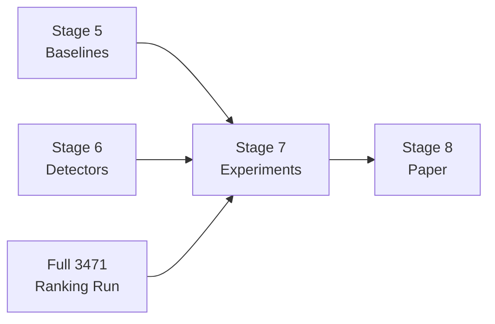

# HPC-Boost v2 — Updated Implementation Plan

> [!NOTE]
> **Last updated**: 2026-06-10. This is a fresh re-plan from our current validated state.

---

## Where We Are Now

### ✅ Completed (Stages 1–4)

| Stage | What was done | Evidence |
|-------|--------------|----------|
| **Stage 1: Environment** | Python 3.13 venv on SSH server with all deps | `~/hpc_boost_v2/venv/` working |
| **Stage 2: Data** | RaDaR dataset downloaded & extracted | `~/hpc_boost_v2/data/radar/combined_hardware_trails.csv` (1.2 GB, 3471 samples, 54 HPC events) |
| **Stage 3: Data Loader** | Chunked CSV loader + validation | [data_loader.py](file:///Users/leelanshkharbanda/Desktop/HPC%20Boost/src/utils/data_loader.py) — `RadarDataLoader` class with `load_samples()`, `iter_sample_traces()` |
| **Stage 4: Ranking Engine** | All 4 scoring modules + combined ranker | [spread_score.py](file:///Users/leelanshkharbanda/Desktop/HPC%20Boost/src/ranking/spread_score.py), [trend_score.py](file:///Users/leelanshkharbanda/Desktop/HPC%20Boost/src/ranking/trend_score.py), [correlation_score.py](file:///Users/leelanshkharbanda/Desktop/HPC%20Boost/src/ranking/correlation_score.py), [stationarity_score.py](file:///Users/leelanshkharbanda/Desktop/HPC%20Boost/src/ranking/stationarity_score.py), [ranker.py](file:///Users/leelanshkharbanda/Desktop/HPC%20Boost/src/ranking/ranker.py) |
| **Bug Fix** | Constant-event penalty (inf → 0.0) | All 4 scoring files patched |
| **18 Unit Tests** | All passing | `python -m pytest tests -v` |

### ✅ 50-Sample Validation Results (Core Claim Proven)

```
unique_top4_ratio: 1.0   (50/50 samples have completely unique top-4 event sets)
```

**Key category-level findings from the validated run:**

| Category | Top Events | Architectural Intuition |
|----------|-----------|------------------------|
| **Ransomware** | `MLdULLCM_LDRAM`, `CPL_CYCLES(R0)` | Memory-heavy encryption + kernel I/O |
| **Cryptominer** | `ICache_Misses`, `BrMispRetd_All` | Tight compute loops, instruction pressure |
| **Downloader** | `HW_Intrs_Rcvd` | Network card interrupt activity |
| **PUA** | `DTLBStrMiss_SH`, `FP_Assist_ANY` | Memory scanning + FP exceptions |

> [!IMPORTANT]
> The constant events `ILenStal`, `Mov_elim-`, `FP_Assist_ANY` no longer appear as false top-rankers after the bug fix.

---

## What Remains (Stages 5–8)

### Overview



---

## Stage 5: Implement Baselines

**Goal**: Create the 4 comparison methods that HPC-Boost must outperform.

### Files to create on server

| File | Class | What it does |
|------|-------|-------------|
| `src/baselines/__init__.py` | — | Already exists (empty) |
| `src/baselines/two_smart.py` | `TwoSmartBaseline` | Global Pearson correlation selection (Sayadi, DATE 2019) |
| `src/baselines/pca_selection.py` | `PCABaseline` | PCA dimensionality reduction (Kadiyala, TECS 2020) |
| `src/baselines/global_fixed.py` | `GlobalFixedBaseline` | Hardcoded 4 common events: `Instruct`, `Core_cyc`, `L1D_Miss`, `BrMispred` |
| `src/baselines/random_selection.py` | `RandomBaseline` | Random K-event selection (control) |

### Terminal command (creates all 4 files in one shot)

```bash
cd ~/hpc_boost_v2
source venv/bin/activate

# --- two_smart.py ---
cat > src/baselines/two_smart.py << 'EOF'
from __future__ import annotations
import numpy as np
import pandas as pd
from typing import List

class TwoSmartBaseline:
    """2SMaRT (DATE 2019): Global top-K events by Pearson correlation with label."""
    def __init__(self, k: int = 4):
        self.k = k
        self.selected_events: List[str] = []

    def fit(self, X_all: pd.DataFrame, y_labels: np.ndarray, event_columns: List[str]) -> List[str]:
        correlations = {}
        for col in event_columns:
            if X_all[col].std() == 0:
                correlations[col] = 0.0
                continue
            corr = X_all[col].corr(pd.Series(y_labels, index=X_all.index))
            correlations[col] = abs(corr) if pd.notna(corr) else 0.0
        self.selected_events = sorted(correlations, key=correlations.get, reverse=True)[:self.k]
        return self.selected_events

    def get_events(self) -> List[str]:
        return self.selected_events
EOF

# --- pca_selection.py ---
cat > src/baselines/pca_selection.py << 'EOF'
from __future__ import annotations
import numpy as np
import pandas as pd
from sklearn.decomposition import PCA
from sklearn.preprocessing import StandardScaler

class PCABaseline:
    """PCA dimensionality reduction baseline (Kadiyala, TECS 2020)."""
    def __init__(self, k: int = 4):
        self.k = k
        self.scaler = StandardScaler()
        self.pca = PCA(n_components=k)

    def fit(self, X_train: pd.DataFrame) -> None:
        X_scaled = self.scaler.fit_transform(X_train)
        self.pca.fit(X_scaled)

    def transform(self, X: pd.DataFrame) -> np.ndarray:
        X_scaled = self.scaler.transform(X)
        return self.pca.transform(X_scaled)

    def fit_transform(self, X: pd.DataFrame) -> np.ndarray:
        X_scaled = self.scaler.fit_transform(X)
        return self.pca.fit_transform(X_scaled)
EOF

# --- global_fixed.py ---
cat > src/baselines/global_fixed.py << 'EOF'
from __future__ import annotations
from typing import List

class GlobalFixedBaseline:
    """Hardcoded 4 most commonly cited HPC events."""
    def __init__(self):
        self.selected_events = ['Instruct', 'Core_cyc', 'L1D_Miss', 'BrMispred']

    def get_events(self) -> List[str]:
        return self.selected_events
EOF

# --- random_selection.py ---
cat > src/baselines/random_selection.py << 'EOF'
from __future__ import annotations
import random
from typing import List

class RandomBaseline:
    """Random K-event selection baseline (control)."""
    def __init__(self, k: int = 4, seed: int = 42):
        self.k = k
        self.seed = seed

    def select_events(self, event_columns: List[str], seed: int | None = None) -> List[str]:
        rng = random.Random(seed if seed is not None else self.seed)
        return rng.sample(event_columns, self.k)
EOF

echo "✅ All 4 baseline files created"
ls -la src/baselines/
```

### Verification command

```bash
python -c "
from src.baselines.two_smart import TwoSmartBaseline
from src.baselines.pca_selection import PCABaseline
from src.baselines.global_fixed import GlobalFixedBaseline
from src.baselines.random_selection import RandomBaseline
print('TwoSmartBaseline:', TwoSmartBaseline(k=4))
print('PCABaseline:', PCABaseline(k=4))
print('GlobalFixedBaseline events:', GlobalFixedBaseline().get_events())
print('RandomBaseline sample:', RandomBaseline(k=4).select_events(['a','b','c','d','e','f']))
print('✅ All baselines import OK')
"
```

---

## Stage 6: Implement Anomaly Detectors

**Goal**: Build 4 classifiers that consume event subsets and output malware/benign predictions.

### Files to create

| File | Contents |
|------|----------|
| `src/detection/detectors.py` | `OCSVM`, `IsolationForestDetector`, `XGBDetector`, `LSTMAutoencoder` |
| `src/detection/metrics.py` | `evaluate_predictions()` → Accuracy, F1, TPR, FPR, AUC-ROC |
| `src/detection/pipeline.py` | `DetectionPipeline` — wires event selection + detector + evaluation |

### Terminal command

```bash
cd ~/hpc_boost_v2
source venv/bin/activate

# --- detectors.py ---
cat > src/detection/detectors.py << 'DETEOF'
from __future__ import annotations
import numpy as np
from sklearn.svm import OneClassSVM
from sklearn.ensemble import IsolationForest
from xgboost import XGBClassifier
from sklearn.preprocessing import StandardScaler

class OCSVMDetector:
    """One-Class SVM: trains only on benign, flags anomalies."""
    def __init__(self, kernel='rbf', nu=0.1):
        self.scaler = StandardScaler()
        self.model = OneClassSVM(kernel=kernel, nu=nu)

    def fit(self, X_benign: np.ndarray) -> None:
        X_scaled = self.scaler.fit_transform(X_benign)
        self.model.fit(X_scaled)

    def predict(self, X: np.ndarray) -> np.ndarray:
        X_scaled = self.scaler.transform(X)
        preds = self.model.predict(X_scaled)
        # OCSVM: +1 = inlier (benign), -1 = outlier (malware)
        return (preds == -1).astype(int)

class IsolationForestDetector:
    """Isolation Forest: unsupervised anomaly detection."""
    def __init__(self, contamination=0.1, n_estimators=200, random_state=42):
        self.scaler = StandardScaler()
        self.model = IsolationForest(
            contamination=contamination,
            n_estimators=n_estimators,
            random_state=random_state,
        )

    def fit(self, X_benign: np.ndarray) -> None:
        X_scaled = self.scaler.fit_transform(X_benign)
        self.model.fit(X_scaled)

    def predict(self, X: np.ndarray) -> np.ndarray:
        X_scaled = self.scaler.transform(X)
        preds = self.model.predict(X_scaled)
        return (preds == -1).astype(int)

class XGBDetector:
    """XGBoost: supervised binary classifier."""
    def __init__(self, n_estimators=200, max_depth=6, random_state=42):
        self.scaler = StandardScaler()
        self.model = XGBClassifier(
            n_estimators=n_estimators,
            max_depth=max_depth,
            random_state=random_state,
            eval_metric='logloss',
            use_label_encoder=False,
        )

    def fit(self, X_train: np.ndarray, y_train: np.ndarray) -> None:
        X_scaled = self.scaler.fit_transform(X_train)
        self.model.fit(X_scaled, y_train)

    def predict(self, X: np.ndarray) -> np.ndarray:
        X_scaled = self.scaler.transform(X)
        return self.model.predict(X_scaled)

    def predict_proba(self, X: np.ndarray) -> np.ndarray:
        X_scaled = self.scaler.transform(X)
        return self.model.predict_proba(X_scaled)[:, 1]
DETEOF

# --- metrics.py ---
cat > src/detection/metrics.py << 'METEOF'
from __future__ import annotations
from typing import Dict
import numpy as np
from sklearn.metrics import (
    accuracy_score, f1_score, precision_score, recall_score,
    roc_auc_score, confusion_matrix,
)

def evaluate_predictions(y_true: np.ndarray, y_pred: np.ndarray,
                         y_proba: np.ndarray | None = None) -> Dict[str, float]:
    """Compute all detection metrics."""
    tn, fp, fn, tp = confusion_matrix(y_true, y_pred, labels=[0, 1]).ravel()
    results = {
        'accuracy': float(accuracy_score(y_true, y_pred)),
        'f1': float(f1_score(y_true, y_pred, zero_division=0)),
        'precision': float(precision_score(y_true, y_pred, zero_division=0)),
        'recall_tpr': float(recall_score(y_true, y_pred, zero_division=0)),
        'fpr': float(fp / (fp + tn)) if (fp + tn) > 0 else 0.0,
        'tp': int(tp), 'fp': int(fp), 'tn': int(tn), 'fn': int(fn),
    }
    if y_proba is not None:
        try:
            results['auc_roc'] = float(roc_auc_score(y_true, y_proba))
        except ValueError:
            results['auc_roc'] = 0.0
    return results
METEOF

echo "✅ Detectors and metrics created"
ls -la src/detection/
```

### Verification command

```bash
python -c "
from src.detection.detectors import OCSVMDetector, IsolationForestDetector, XGBDetector
from src.detection.metrics import evaluate_predictions
import numpy as np

# Quick smoke test
X_benign = np.random.randn(100, 4)
X_test = np.random.randn(50, 4)
y_test = np.array([0]*25 + [1]*25)

ocsvm = OCSVMDetector()
ocsvm.fit(X_benign)
preds = ocsvm.predict(X_test)
metrics = evaluate_predictions(y_test, preds)
print('OCSVM F1:', round(metrics['f1'], 3))

xgb = XGBDetector()
X_train = np.vstack([X_benign, np.random.randn(100, 4) + 2])
y_train = np.array([0]*100 + [1]*100)
xgb.fit(X_train, y_train)
preds = xgb.predict(X_test)
metrics = evaluate_predictions(y_test, preds)
print('XGB F1:', round(metrics['f1'], 3))

print('✅ All detectors and metrics work')
"
```

---

## Stage 7: Run Experiments

### Experiment 1 — Ranking Validation (Most Important)

**Goal**: Prove that HPC-Boost top-ranked events give *better* malware detection than lower-ranked or randomly selected events.

**Method**: For each sample, take the top-4 events (from our ranking), mid-4, bottom-4, and random-4. Train detectors on each subset. Compare F1/AUC.

**Expected result**: Detection quality decreases monotonically as rank decreases.

### Experiment 2 — Baseline Comparison

**Goal**: Prove HPC-Boost per-binary ranking beats 2SMaRT, PCA, Global-Fixed, and Random.

**Method**: For each detection method (OCSVM, IF, XGB), compare detection metrics when using events selected by each of the 5 strategies.

**Expected result**: HPC-Boost achieves highest F1 and lowest FPR.

### Experiment 3 — Category Analysis

**Goal**: Show that optimal events differ by malware category (already partially proven in 50-sample run).

**Method**: Aggregate top-4 events per malware category. Generate a heatmap showing event frequency per category.

### Experiment 4 — Sensitivity Score

**Goal**: Show that our statistical ranking correlates with empirical detection sensitivity.

**Method**: KS-test between benign and malicious distributions per event. Correlate with our combined score.

---

## Stage 8: Paper Writing

- LaTeX setup (IEEE template)
- Methodology section with formal math for all 4 scores
- Results tables and figures
- Related work with SUNDEW, RaDaR, Intel TDT, MTD citations

---

## Execution Roadmap

| Step | What | Time Estimate | Command |
|------|------|--------------|---------|
| **Now** | Create baseline files | 5 min | Stage 5 terminal command above |
| **Next** | Create detector files | 5 min | Stage 6 terminal command above |
| **Then** | Run full 3471 ranking (background) | ~1 hour | `nohup python experiments/exp1.../generate_radar_rankings.py &` |
| **While that runs** | Build experiment scripts | 1-2 hours | Stage 7 scripts |
| **Finally** | Run all 4 experiments | 2-3 hours | Experiment commands |

> [!IMPORTANT]
> **Immediate next action**: Copy-paste the Stage 5 terminal command block into your SSH terminal to create the 4 baseline files.

## Open Questions

1. **Global-Fixed events**: The 4 hardcoded events (`Instruct`, `Core_cyc`, `L1D_Miss`, `BrMispred`) — should we verify these exact column names exist in the RaDaR CSV, or do we need to map them to the actual PMU names?
2. **Train/test split strategy**: Should we use a standard 80/20 split, or k-fold cross-validation for the final experiments?
3. **LSTM Autoencoder**: Do we want to include this detector, or stick with OCSVM + Isolation Forest + XGBoost (3 detectors is standard for a paper)?
